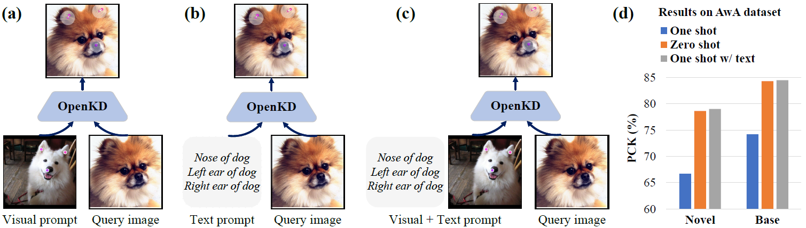

<div align="center">
	
# OpenKD: Opening Prompt Diversity for Zero-and Few-shot Keypoint Detection

The official implementation for paper **OpenKD: Opening Prompt Diversity for Zero-and Few-shot Keypoint Detection**.

[**Changsheng Lu**](https://alanlusun.github.io/), [**Zheyuan Liu**](https://www.zheyuanliu.me/), [**Piotr Koniusz**](https://www.koniusz.com/)

##

[](https://www.ecva.net/papers/eccv_2024/papers_ECCV/papers/02866.pdf) 
[](https://arxiv.org/abs/2409.19899)
[](https://opensource.org/licenses/MIT)

</div>

##

**News and upcoming updates**

- [x] We released the source code and diverse text prompt sets!


## 1. Introduction
**TL;DR:** In this paper, we propose an OpenKD model with several intriguing features: 1) supporting both visual and textual prompts, 2) having the potential to handle unseen texts and diverse texts, and 3) maintaining strong generality and performance on *zero-shot keypoint detection (ZSKD)* and *few-shot keypoint detection (FSKD)*. We report that LLM is capable of being a reasoner for text interpolation, and a good language parser for parsing diverse texts. We also contribute four diverse text prompt sets for the popular Animal pose dataset, AwA, CUB, and NABird for fair evaluations. To our best knowledge, we are the first to open semantics and language diversity of text prompts for keypoint detection.

 


## 2. Requirements

We provided the major involved python packages in [requirements.txt](https://github.com/AlanLuSun/OpenKD/blob/main/requirements.txt). The code relies on minimal external packages and should be easy to run after installing the 
- pytorch
- opencv, yacs, etc.


## 3. Dataset Preparation
- Animal pose dataset
  
  For easy bootstrapping your own experiments and reproducing our results, we have uploaded the entire Animal pose dataset [here](https://drive.google.com/file/d/1G81INOtQogf8-23TfHbVVYvGKkNHRzJT/view?usp=sharing). After downloading the Animal pose dataset, the folders invovled in our OpenKD source codes are

  ```angular2html
  |--Animal_Dataset_Combined  
    |--gt_coco
    |--images
    |--saliency_maps
    |--readme-coco.txt
  ```
  ```gt_coco``` folder gives the keypoint annotations in COCO format; ```saliency_maps``` folder provides the saliency maps corresponding to the RGB images in folder ```images```. Note that all those saliency maps were extracted via the off-the-shelf saliency detector [SCRN](https://github.com/wuzhe71/SCRN). The saliency maps are used to prune invalid auxiliary keypoints generated by visual interpolation.
  
  Please modify the paths of IMAGE_ROOT, JSON_ROOT, SALIENCY_MAPS_ROOT under DATASET.ANIMAL_POSE in config file [openkd.yaml](https://github.com/AlanLuSun/OpenKD/blob/main/experiments/configs/openkd.yaml#L131-L133), using your local paths of ```images```, ```gt_coco```, and ```saliency_maps``` 
- (Optional) AwA pose dataset
  
  AwA pose is another animal pose dataset, whose images can be downloaded [here](https://github.com/prinik/AwA-Pose). We provided the curated COCO annotations for AwA pose [here](https://drive.google.com/file/d/15f0Y2U6Df-fgpd2AAIrL9I_deyevNLdU/view?usp=sharing). The saliency maps can be extracted via the off-the-shelf saliency detector [SCRN](https://github.com/wuzhe71/SCRN). 

  Please modify the paths of DATASET.AWA in [openkd.yaml](https://github.com/AlanLuSun/OpenKD/blob/main/experiments/configs/openkd.yaml#L136-L138) accordingly.

- (Optional) [CUB](https://www.vision.caltech.edu/datasets/cub_200_2011/) and [NABird](https://dl.allaboutbirds.org/nabirds) datasets 

  Please download these well-known bird datasets online, respectively. Similarly, you can extract their saliency maps as Animal pose and AwA pose datasets. We also provided their curated COCO annotations [here](https://drive.google.com/file/d/15f0Y2U6Df-fgpd2AAIrL9I_deyevNLdU/view?usp=sharing). 

  Remember to modify the corresponding paths in config file [openkd.yaml](https://github.com/AlanLuSun/OpenKD/blob/main/experiments/configs/openkd.yaml#L139-L148) accordingly.

## 4. Model Training

- Download the [pre-trained weights of CLIP](https://github.com/openai/CLIP/blob/main/clip/clip.py#L31-L39), and place them into your local folder, e.g., ```pretrained_models/clip_weights```. Afterwards, please modify the path of CLIP.WEIGHTS_ROOT in config file [openkd.yaml](https://github.com/AlanLuSun/OpenKD/blob/main/experiments/configs/openkd.yaml#L12)

- Train the OpenKD model
  ```bash
  python3 train_openkd.py --cfg_file experiments/configs/openkd.yaml
  ```

## 5. Zero-shot and few-shot testing
You can modify the TEST.NUM_TEST_SHOT and TEST.TEXT_PROMPT_SETTING.NUM_TEXT to perform 0-shot, 1-shot, or 1-shot with text testing as follows:

- 0-shot testing
  ```bash
  python3 eval_openkd.py --cfg_file experiments/configs/openkd.yaml
  ```

- 1-shot testing
  ```bash
  python3 eval_openkd.py --cfg_file experiments/configs/openkd.yaml \
  TEST.NUM_TEST_SHOT 1 \
  TEST.TEXT_PROMPT_SETTING.NUM_TEXT 0
  ```
- 1-shot with text testing
  ```bash
  python3 eval_openkd.py --cfg_file experiments/configs/openkd.yaml \
  TEST.NUM_TEST_SHOT 1 \
  TEST.TEXT_PROMPT_SETTING.NUM_TEXT 1
  ```

## 6. 1000 diverse text prompts testing
We provide the 1000 diverse text prompts for Animal pose dataset, AwA pose, CUB, and NABird datasets in [```datasets/text_prompts```](https://github.com/AlanLuSun/OpenKD/tree/main/datasets/text_prompts), to support the research of diverse text prompting. The prompts are in json files.

As demonstrated in our paper, LLM is a good parser to extract keypoint texts from diverse texts, thus we provided two types of parsed results, which were parsed by GPT3.5 and Vicuna, respectively. Either kind of json files stored 1000 identical diverse text prompts, but with different parsed results.

The interesting diverse text prompting can be done via
  ```bash
  python3 eval_diverse_prompts_noparsing.py --cfg_file experiments/configs/openkd.yaml
  ```


## 7. Citation

If you find this code useful for your research, please cite our work.
```bibtex
@InProceedings{openKD_eccv24,
  author={Changsheng Lu and Zheyuan Liu and Piotr Koniusz},
  title={OpenKD: Opening Prompt Diversity for Zero- and Few-shot Keypoint Detection},
  booktitle={European Conference on Computer Vision (ECCV)},
  year={2024},
}
```

## 8. Contact

 * Raise a new [GitHub issue](https://github.com/AlanLuSun/OpenKD/issues/new) or contact me at changshengluu@gmail.com
